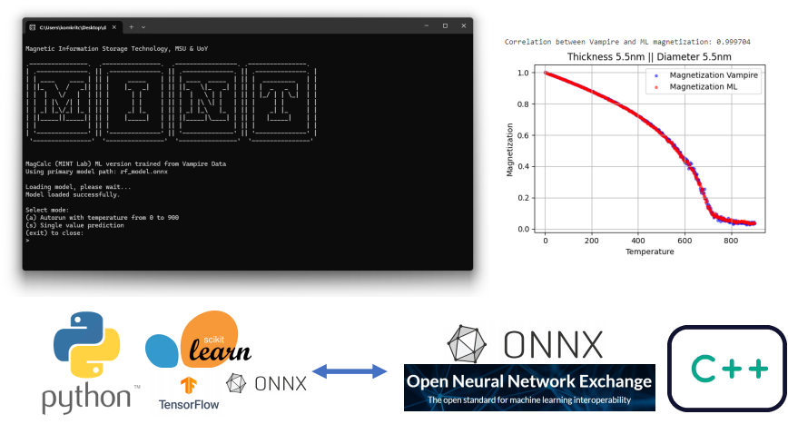

MagCalc is a powerful software tool designed for predicting magnetization as a function of temperature, utilizing a trained model from the Vampire software. 

MagCalc is a program developed to calculate and study the magnetic material FePt (Iron-Platinum), which is composed of iron (Fe) and platinum (Pt) elements. This material is known for its outstanding properties in data storage for magnetic memory devices, such as Hard Disk Drives. FePt possesses permanent magnetic properties with high magnetic anisotropy, allowing it to maintain magnetization in very small sizes and withstand high temperatures. The program calculates magnetization values in the temperature range of 0-900K, where users can specify the desired thickness and diameter of the material. The program automatically calculates the magnetization versus temperature relationship.
What makes MagCalc stand out is its use of a Machine Learning (ML) model trained through atomic-scale simulations using Vampire software. The data obtained from these simulations helps the ML model learn the behavior and magnetic properties of FePt under various temperatures and parameter adjustments, such as thickness and diameter. Once trained, the ML model can quickly predict FePt magnetization values without the need for repeated simulations, significantly reducing calculation time. The original simulation time of approximately 3 hours per run has been reduced to about 1 second per calculation. With the program's high speed and accuracy, users can analyze and explore FePt material behavior more efficiently.

